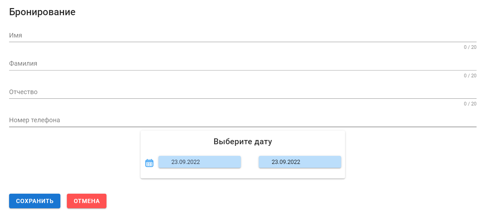

# Flat-rent calendar
## Installation
1. Copy `.env.example` to a `.env` file in the same directory:

> cp .env.example .env

2. Install NodeJS dependencies:
> npm install

3. Install Vue.js dependencies:
> cd app
> npm install

## Execution
1. To run frontend apart:
> cd app
> npm run serve 
> 
2. To run backend and frontend together:
> cd app 
> npm run build
> cd ..
> npm run dev / node server.js

## App view
### Start page: 

### Order popup:

### Daterange picker:

